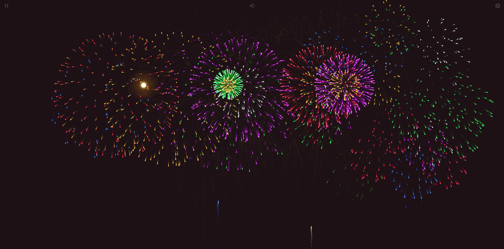

# Code Pháo Hoa Đón Tết



Dự án hiển thị hiệu ứng pháo hoa đón Tết sử dụng HTML5 Canvas và JavaScript

## Tính năng chính
- Hiệu ứng pháo hoa đa dạng màu sắc
- Animation mượt với physics simulation
- Tự động resize theo màn hình
- Hiệu ứng particle tỏa sáng
- Hỗ trợ cả desktop và mobile

## Cách sử dụng
1. Clone repo
   ```bash
   git clone https://github.com/Quochung1st-dev/code-phao-hoa-html.git
   ```
2. Mở file `index.html` bằng trình duyệt

## Cấu hình
Thay đổi các thông số trong `js/MyMath.js` để tuỳ chỉnh:
- Số lượng particle
- Tốc độ bắn pháo hoa
- Trọng lực
- Thời gian fade

## Thư viện sử dụng
- [Stage.js 0.1.4](js/Stage.0.1.4.js)
- [fscreen 1.0.1](js/fscreen.1.0.1.js)
- Bootstrap 4 (CDN)

## License
MIT License
